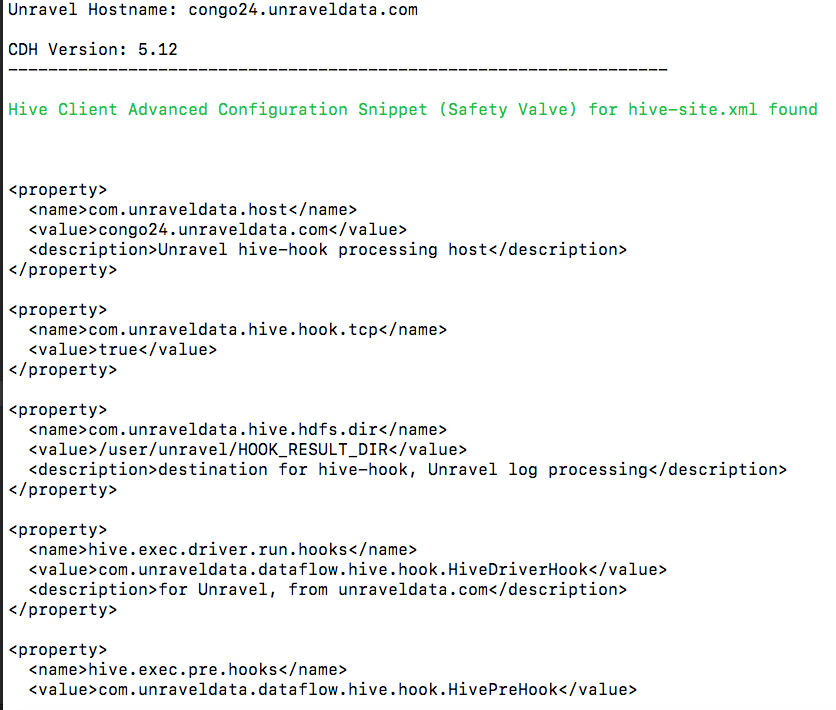
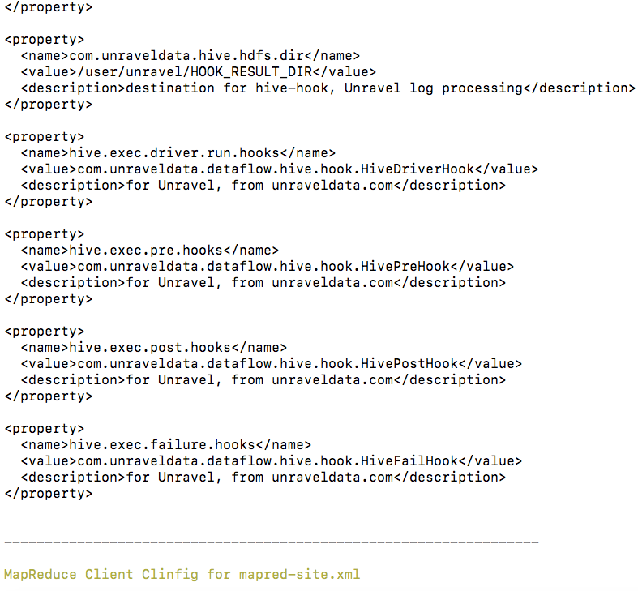
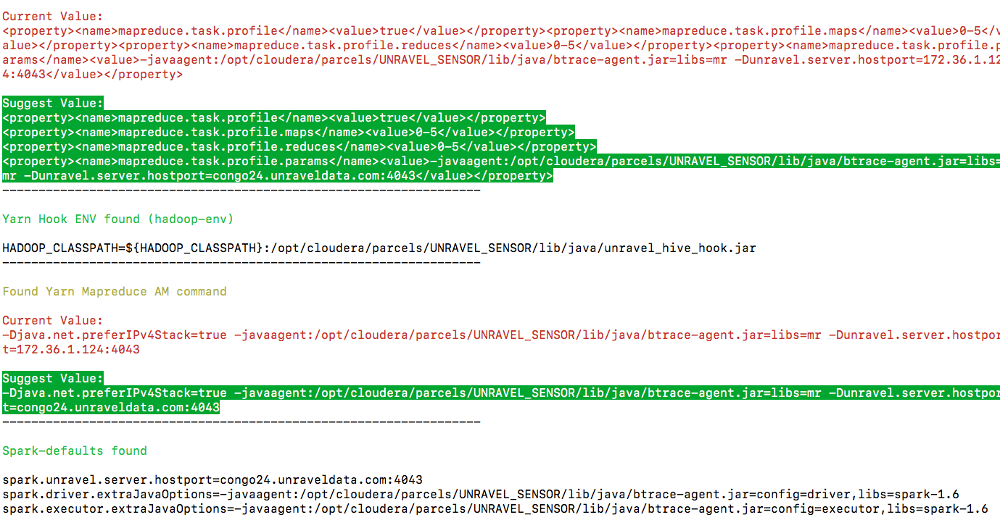
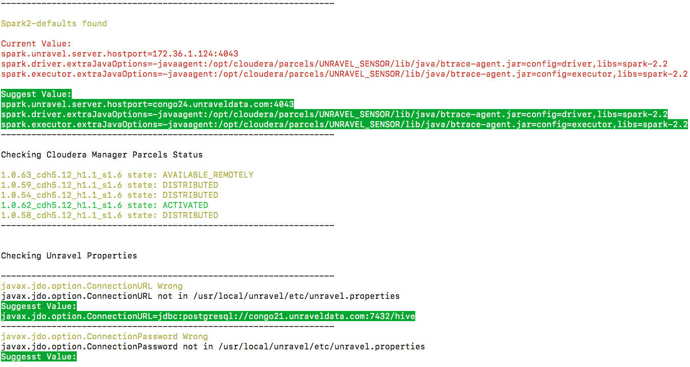
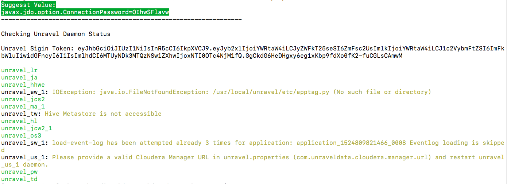

## check_cdh_config.py

#### sample usage:
`./check_cdh_config.py --spark-version 1.6,2.2 --cm_host congo21.unraveldata.com --unravel-host congo24.unraveldata.com`

```
required arguments:

  --spark-version SPARK_VER
                        spark version e.g. 1.6 or 2.2
  --cm_host CM_HOSTNAME
                        hostname/IP of Cloudera Manager Server

optional arguments:

  --unravel-host UNRAVEL
                        Unravel Server hostname or IP address, default: local hostname
  -user USER, --user USER
                        CM Username, default: admin
  -pass PASSWORD, --password PASSWORD
                        CM Password, default: admin
  -uuser UNRAVEL_USERNAME, --unravel_username UNRAVEL_USERNAME
                        Unravel UI Username, default: admin
  -upass UNRAVEL_PASSWORD, --unravel_password UNRAVEL_PASSWORD
                        Unravel UI Password, default: unraveldata
  -h, --help            show this help message and exit
 ```

#### Fields that this script will check:
* Cloudera Configuration
    * hadoop-env.sh
    * mapred-site.xml
    * hive-site.xml
    * hive-env.sh
    * spark-defaults
    * spark2-default
    * Unravel Sensor parcel state
* /usr/local/unravel owner and group
* unravel.properties file
    * Hive Metastore properties
* Daemone status and error/fatal messages from Unravel UI

#### packages used (install them manually if getting import error):
- pip
- cm-api
- termcolor
- requests

#### sample output:





