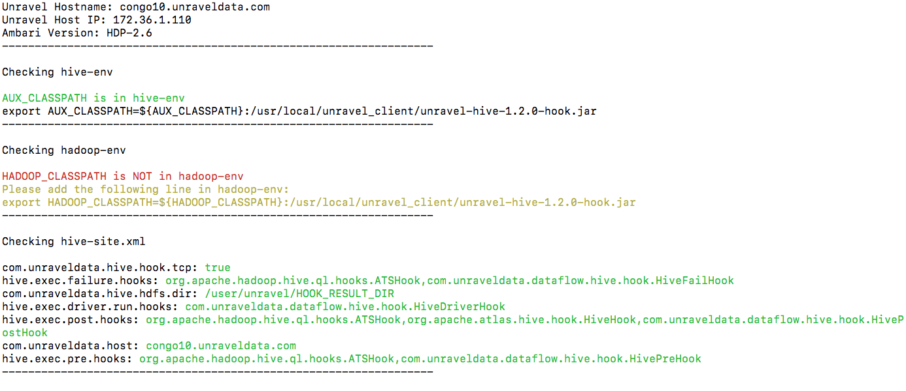
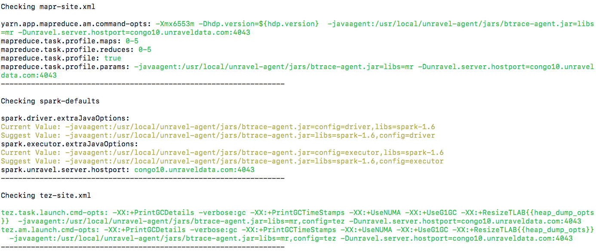
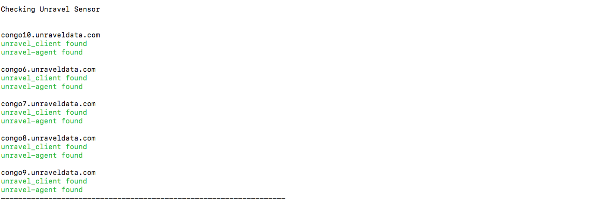
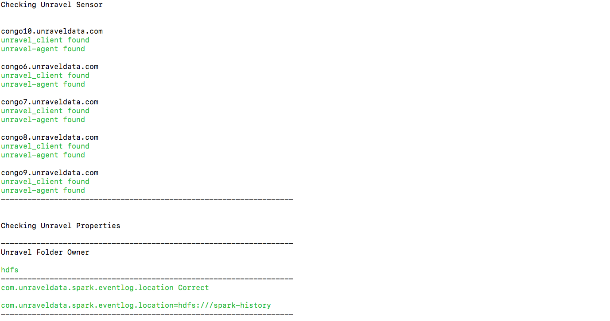
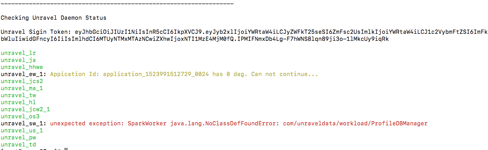

## check_hdp_config.py

#### sample usage:
`python check_hdp_config.py --spark-version 1.6,2.2 --hive-version 1.2 --am_host congo6.unraveldata.com --unravel-host congo10.unraveldata.com --ssh_user root --ssh_password unraveldata`

```
required arguments:

  --spark-version SPARK_VER
                        spark version e.g. 1.6 or 2.2
  --am_host AM_HOSTNAME
                        hostname/IP of Ambari Server

optional arguments:
  --hive-version HIVE_VER
                        hive version e.g. 1.2
  --unravel-host UNRAVEL
                        Unravel Server hostname or IP address, default: local hostname
  -user USER, --username USER
                        Ambari login Username, default: admin
  -pass PASSWORD, --password PASSWORD
                        Ambari login Password, default: admin
  -uuser UNRAVEL_USERNAME, --unravel_username UNRAVEL_USERNAME
                        Unravel UI Username, default: admin
  -upass UNRAVEL_PASSWORD, --unravel_password UNRAVEL_PASSWORD
                        Unravel UI Password, default: unraveldata
  --ssh_user SSH_USER   
                        SSH username for all Cluster Host
  --ssh_password SSH_PASSWORD
                        SSH password for all Cluster Host
  --ssh_key SSH_KEY     
                        SSH key full path for all Cluster Host
  -h, --help            show this help message and exit
 ```

#### Fields that this script will check:
* Ambari Configuration
    * hadoop-env.sh
    * mapred-site.xml
    * hive-site.xml
    * hive-env.sh
    * spark-defaults
    * spark2-defaults
* Unravel Sensor Deployment in every host:
    * ssh credentials needed otherwise sensor check will be skipped
        * ssh user
        * ssh password (if ssh key used this will be the password of ssh key)
        * ssh key
* /usr/local/unravel owner and group
* unravel.properties file
    * Spark event log dir properties
* Daemone status and error/fatal messages from Unravel UI

#### packages used (install them manually if getting import error):
- pip
- paramiko
- termcolor
- requests

#### sample output:





